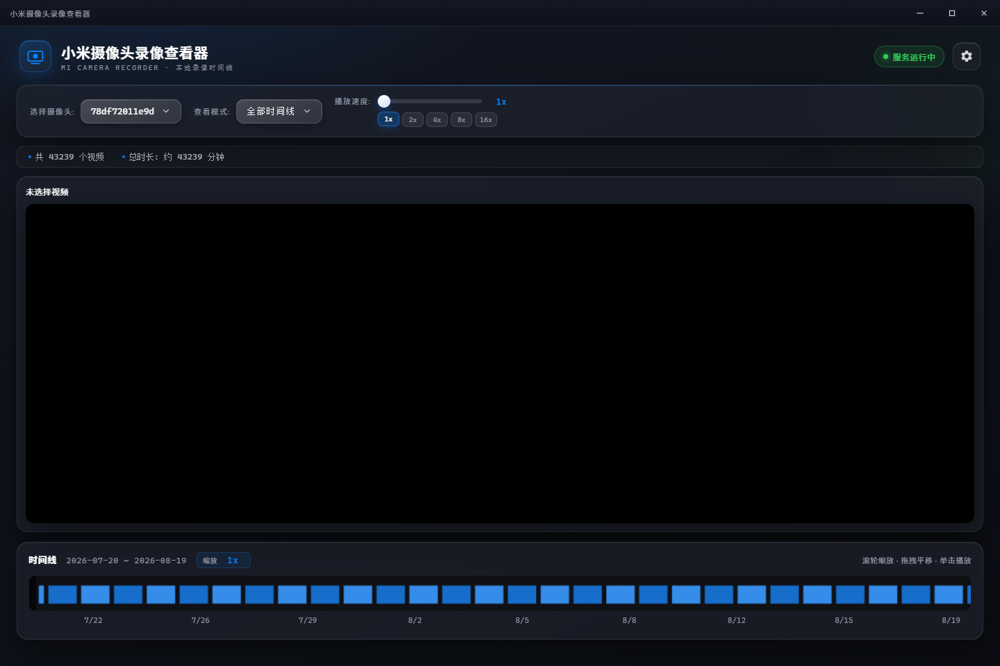

# 小米摄像头录像查看器

> 一个漂亮的本地录像时间线查看器，让长达数万分钟的摄像头录像一屏尽览。

深色玻璃拟态界面，支持时间线缩放/平移、悬停预览、倍速播放，可打包为 Windows 绿色版应用直接双击使用。



## ✨ 功能特性

- **摄像头管理**：自动扫描并列出所有摄像头
- **时间线可视化**：Canvas 绘制全部录像，支持缩放（1x–128x）与拖拽平移
- **双查看模式**：按日期查看 / 全部时间线
- **悬停预览**：鼠标悬停时间线即时预览画面，双缓冲避免黑帧
- **线性缩放**：以鼠标位置为锚点平滑缩放，边缘不偏
- **倍速播放**：滑块 + 快捷按钮（1x / 2x / 4x / 8x / 16x）
- **无缝切换**：视频切换无黑屏、无跳动
- **全屏模式**：一键进入沉浸式全屏时间线
- **可配置视频目录**：网页内设置视频存储路径，并自动持久化

## 🚀 快速开始

### 方式一：使用打包好的绿色版（推荐）

直接运行打包产物，无需安装任何环境：

```text
dist/MI-Video-Viewer-Portable-1.0.0.exe   # 单文件便携版
dist/MI-Video-Viewer-1.0.0.zip            # 目录绿色版
```

首次运行后，在应用右上角设置中选择你的视频目录即可。

### 方式二：从源码运行（开发）

需要 Node.js 14+ 与 npm。

```bash
# 安装依赖
npm install

# 启动服务器，浏览器访问 http://localhost:3000
npm start

# 或直接以 Electron 桌面窗口运行
npm run electron
```

## 🛠️ 打包为 Windows 应用

```bash
# 同时生成 portable 单文件版 + zip 绿色目录版
npm run build:win
```

产物输出到 `dist/` 目录。应用会自动使用 `build/icon.ico` 作为图标。

## 🎮 使用说明

1. **选择摄像头**：顶部下拉选择摄像头
2. **查看模式**：
   - 按日期查看：选择指定日期的录像
   - 全部时间线：查看该摄像头全部录像
3. **时间线操作**：
   - 鼠标悬停：显示预览与时间
   - 点击：播放对应录像
   - 滚轮：以鼠标位置为中心缩放
   - 拖拽：平移时间线
4. **播放控制**：
   - 播放/暂停（按钮）与倍速调节（滑块 + 快捷档位）
   - 全屏：点击视频区按钮或进入全屏
5. **设置**：右上角齿轮可配置视频目录、预览框大小

## 📦 目录结构

```
MIVideoViewer/
├── public/               # 前端
│   ├── index.html        # 页面结构
│   ├── style.css         # 玻璃拟态样式
│   └── app.js            # 前端逻辑
├── server.js             # Express 后端服务
├── electron-main.js      # Electron 主进程（窗口、打包）
├── preload.js            # Electron 安全桥接
├── build/
│   ├── afterPack.js      # 打包后精简（清理语言包等）
│   ├── icon.ico          # 应用图标
│   └── make-icon.js      # 图标生成脚本
├── config.json           # 配置文件
├── package.json          # 项目与打包配置
├── start.bat             # Windows 命令行启动脚本
├── start.py              # Python 启动脚本
└── README.md             # 说明文档
```

## 🗂️ 视频目录格式

应用按以下结构扫描录像：

```
视频根目录/
└── 摄像头名称/
    └── YYYYMMDDHH/           # 日期时间文件夹
        └── MMMSS_timestamp.mp4   # 视频文件（1 分钟/个）
```

示例：

```
X:\xiaomi_camera_videos\
├── camera_living_room\
│   ├── 2024031508\
│   │   ├── 00M00S_1710489600000.mp4
│   │   └── 01M00S_1710489660000.mp4
│   └── 2024031509\
│       └── ...
└── camera_bedroom\
    └── ...
```

## ⚙️ 配置说明

`config.json`（可通过网页右上角设置修改）：

| 字段 | 说明 | 默认值 |
|------|------|--------|
| videoBasePath | 视频根目录路径 | X:\xiaomi_camera_videos |
| port | 服务器端口 | 3000 |
| previewSize | 预览框大小（small/medium/large） | medium |

## 🧱 技术栈

- 后端：Node.js + Express
- 前端：原生 HTML / CSS / JavaScript
- 界面风格：玻璃拟态（Glassmorphism）
- 视频播放：HTML5 Video API
- 时间线渲染：Canvas
- 桌面打包：Electron + electron-builder

## ❓ 常见问题

**1. 视频无法播放**
检查视频目录路径是否正确、文件是否为 MP4、浏览器控制台是否有报错。

**2. 摄像头列表为空**
确认视频根目录下存在按名称命名的子文件夹，且文件夹内录像符合命名规范。

**3. 时间线显示异常**
刷新页面；检查视频文件命名是否符合 `MMMSS_timestamp.mp4` 格式。

## 📄 许可证

MIT License
